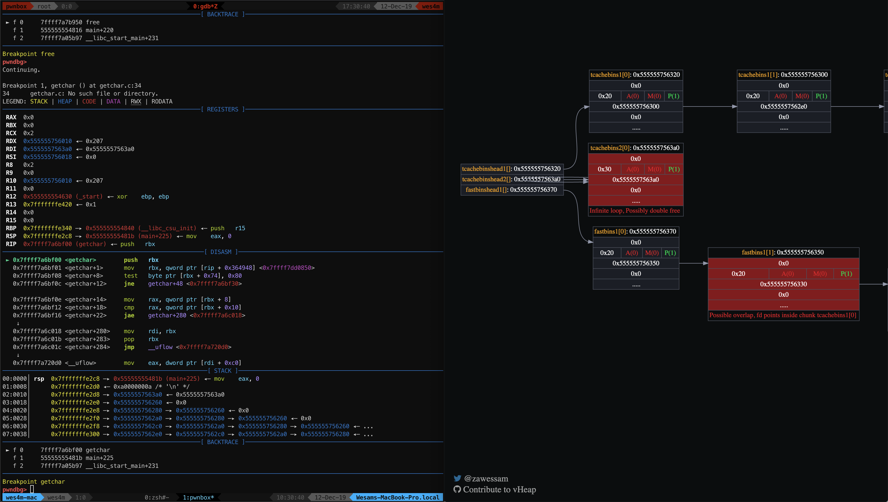

# vHeap
Extendable Visualization &amp; Exploitation tool for glibc heap.

vHeap is a python/js project aimed at visualizing the glibc heap memory at runtime during your debugging sessions to make your life easier ✨.

The heap memory is one of those things that are much easier to work with and learn when visualized. Most security researchers/ctf players end up sketching the heap memory to exploit it.

## Showcase



## Support & installation
This vHeap version is built to work with [pwndbg](https://github.com/pwndbg/pwndbg) on GDB (requires GDB v11 and higher).

Clone and install [pwndbg](https://github.com/pwndbg/pwndbg) then
```
git clone https://github.com/wes4m/vheap.git
cd vheap
./setup.sh PWNDBG_PATH
```
## Usage
To start serving; from within your GDB session vHeap shows you everything in the webbrowser.
```
vhserv localhost 1337 --data-bytes 64
```
`vhstop` to stop the server.

Each chunk includes a bounded view of its payload. Increase or reduce the
bound without restarting the server with:
```
vhstate --data-bytes 256
vhstate --data-bytes 0       # hide payload bytes
```
The value is measured in bytes and is rendered as pointer-sized rows. The
default is 64 bytes per chunk.

To update the heap state.
```
vhstate
```
The heap state is updated automatically on each stop. You can disable auto updating using the `vhserv --no-auto-update` argument during vheap start.

By default the view also adds best-effort `malloc_state`/arena, `heap_info`,
`malloc_par`, and tcache management nodes when the active Pwndbg or libc
symbols expose them. Use `vhserv --no-structures` or `vhstate --no-structures`
to disable this collection.

## Extending
vHeap can be easily modified to work with other debuggers and any other form of input methods.
It is also built while keeping in mind extendability and adding custom functionalities; More at [EXTENDING DOCS](https://github.com/wes4m/vheap/blob/master/EXTENDING.md).


## Current status
vHeap to do tasks:
-  Selecting different arenas.
-  Better overlap detection.
-  Making docs.
-  ?? ..

Contributions are appreciated 💛.
